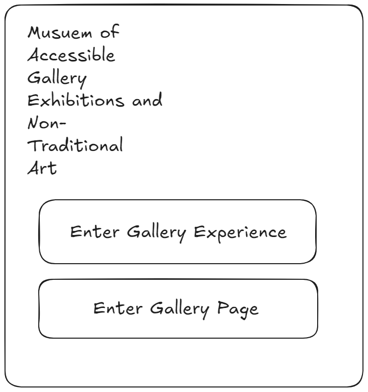
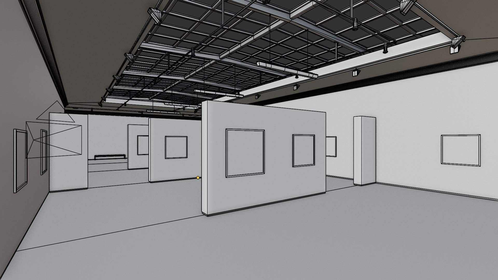
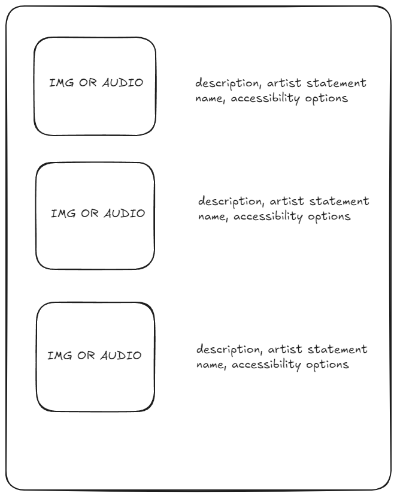
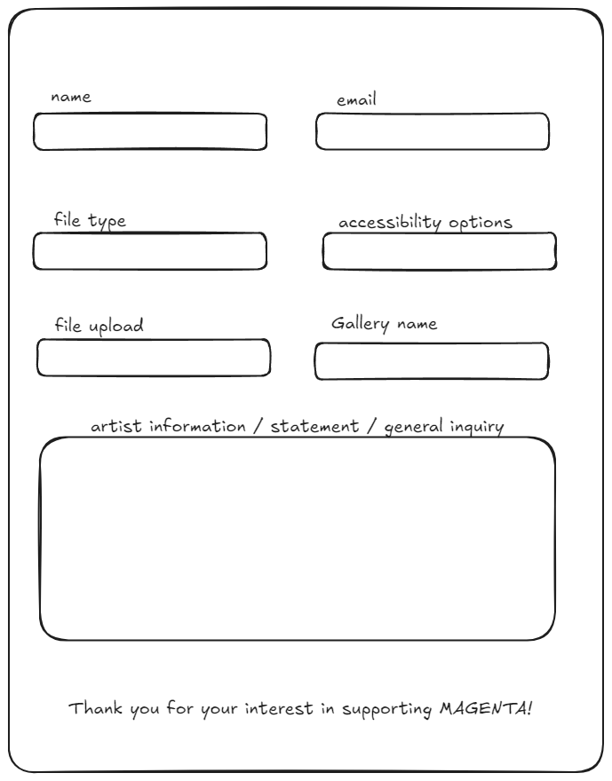
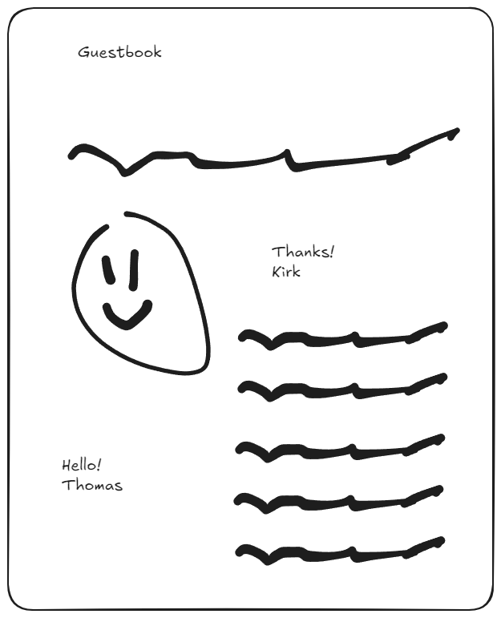

# MAGENTA (Museum of Accessible Gallery Exhibitions and Non-Traditional Art)

## Overview

MAGENTA is a web-based virtual gallery focused on accessibility and inclusivity in art. The gallery provides an immersive 3D experience for users through first-person navigation, rendered using ASCII shaders via Three.js. In addition to the virtual experience, MAGENTA offers an accessible web interface that showcases the same artwork in a more traditional format, adhering to W3C Accessibility Guidelines. The gallery will feature a wide variety of non-traditional artworks, providing a unique and inclusive space for both artists and audiences.

### Problem

Many existing galleries lack accessible features, preventing people with visual, auditory, or motor impairments from fully enjoying the art. MAGENTA aims to address this by creating a gallery that is inclusive and open to all, using both virtual and accessible web formats to ensure everyone can experience and engage with the exhibitions.

### User Profile

- **Primary Users**:
  - Art enthusiasts who enjoy experiencing visual, audio, or video art in both virtual and web-based formats.
- **Secondary Users**:
  - Artists who want to showcase their non-traditional artworks in an accessible, curated online gallery.
- **Special Considerations**:
  - MAGENTA prioritizes accessibility for users with visual, auditory, or motor impairments. Features such as high-contrast mode, adjustable camera speed, and keyboard navigation will be implemented to ensure inclusivity.

### Features

- As a user, I want to explore an immersive 3D virtual gallery.
- As a user, I want to access an easy-to-navigate, accessibility-compliant web version of the artwork.
- As a user, I want to navigate the gallery using keyboard controls.
- As a user, I want to leave guestbook entries with a limit of one entry per day.
- As an artist, I want to submit my non-traditional artwork with accessibility features such as alt text, captions, and a prose-like description.
- As an artist, I want flexibility in how my audio work is visually represented.

## Implementation

### Tech Stack

- **Frontend**: HTML, SCSS, JavaScript, React, React Router
- **3D Rendering**: Three.js (with ASCII shaders)
- **Backend**: Node.js, Express
- **Audio-Visual Libraries**:
  - p5.js Sound Library for audio analysis and waveform visualizations.
  - Tone.js for sound synthesis and customizable visual reactions.
  - Three.js Audio Analyser for extracting frequency data and creating real-time visuals.
- **Accessibility Tools**:
  - ARIA roles and tabindex for screen reader support.
  - High contrast mode with `prefers-contrast: high` detection or manual toggle.
  - Keyboard navigation for movement and interaction.
  - Adjustable camera speed using Three.js `PointerLockControls`.
  - Pause/Play button for animations.
- **Spam Prevention**:
  - LocalStorage-based rate limiting for guestbook submissions.
  - reCAPTCHA v3 for lightweight spam filtering.

### APIs

No external APIs will be required for the first iteration. All content will be user-generated and stored locally or in a database.

### Sitemap

1. **Home Page**: Introduction to MAGENTA, with clear entry points to both the virtual gallery and accessible exhibit pages.
2. **3D Gallery Page**: A fully immersive, first-person virtual gallery experience rendered using ASCII shaders.
3. **Accessible Exhibit Page**: A traditional display of artwork with alt text, artist statements, and accessibility-compliant elements.
4. **Artist Submission Page**: A form for artists to submit their work, including accessibility information such as alt text, captions, and `artsy_altText`.
5. **Guestbook Page**: An interactive guestbook where users can leave comments, with spam prevention and moderation capabilities.

## Mockups

At the moment mockups are quite minimal, There will be a lot more detail once I begin working on it.

### Landing Page
This mockup represents the landing page for MAGENTA, highlighting the museum's acronym 'MAGENTA' which stands for Museum of Accessible Gallery Exhibitions and Non-Traditional Art, with navigation options to enter the gallery experiences.  


### 3D Gallery Model
This image depicts a model of the 3D gallery space within MAGENTA, showcasing a minimalistic and modern interior suitable for displaying various artworks.  


### Gallery Webpage
A mockup of the gallery's webpage, displaying a simple and accessible layout for viewing art pieces online, complete with descriptions and artist statements.  


### Artist Submission Page
This mockup outlines the artist submission page, designed for artists to easily submit their works along with relevant information like artist statements and accessibility features.  


### Guestbook
A playful and interactive guestbook page design where visitors can leave messages, drawings, and thanks, enhancing the community feel of the gallery.  


### Data

- **Artwork Data**: Information about each artwork, including title, artist, artist statement, alt text, `artsy_altText`, and file type.
- **Guestbook Entries**: Stored locally to enforce rate limiting for submissions (one entry per day).
- **Artist Submissions**: Data about the submitted works, curated pieces, and exhibition schedules.

### Endpoints

#### Guestbook Endpoints

**POST /guestbook**  
Submit a new guestbook entry.

**Request Parameters**:
- `name` (optional)
- `message`
- `timestamp`

**Response**:  
json:  
```
{
    "status": "success",
    "message": "Guestbook entry added."
}
```
---

**GET /guestbook**  
Retrieve all guestbook entries.

**Response**:  
json:  
```
[
    {
        "name": "John Doe",
        "message": "This gallery is amazing!",
        "timestamp": "2024-09-09T14:48:00Z"
    }
]
```
---

**DELETE /guestbook/:id**  
Delete a guestbook entry (for moderation).

**Request Parameters**:
- `id`: The unique identifier for the guestbook entry.

**Response**:  
json:  
```
{
    "status": "success",
    "message": "Guestbook entry deleted."
}
```
---

#### Artwork Management Endpoints

**POST /artwork**  
Submit new artwork to the accessible page.

**Request Parameters**:
- `title`
- `artist`
- `file`
- `artistStatement`
- `altText`
- `artsy_altText`
- `type` (e.g., "image", "video", "audio")

**Response**:  
json:  
```
{
    "status": "success",
    "message": "Artwork posted successfully."
}
```
---

**GET /artwork**  
Retrieve all artworks on display.

**Response**:  
json:  
```
[
    {
        "id": 1,
        "title": "Sunset Over the City",
        "artist": "Jane Doe",
        "artistStatement": "A reflection on urban solitude...",
        "altText": "A glowing sunset behind skyscrapers...",
        "artsy_altText": "A warm embrace of color as the day retreats from the city...",
        "fileUrl": "/uploads/sunset.jpg",
        "type": "image"
    }
]
```
---

**PUT /artwork/:id**  
Update an existing artwork's details.

**Request Parameters**:
- Same as `POST /artwork`, with optional fields for updates.

**Response**:  
json:  
```
{
    "status": "success",
    "message": "Artwork updated successfully."
}
```
---

**DELETE /artwork/:id**  
Remove an artwork from the accessible page.

**Request Parameters**:
- `id`: The unique identifier for the artwork.

**Response**:  
json:
```  
{
    "status": "success",
    "message": "Artwork deleted."
}
```
---

#### Exhibits Management Endpoints

**POST /exhibits**  
Create a new exhibit.

**Request Parameters**:
- `title`
- `description`
- `artworkIds` (array)

**Response**:  
json:  
```
{
    "status": "success",
    "message": "Exhibit created successfully."
}
```
---

**GET /exhibits**  
Retrieve all exhibits, both active and archived.

**Response**:  
json:  
```
[
    {
        "id": 1,
        "title": "Urban Reflections",
        "description": "A collection exploring the intersection of city life and nature.",
        "artwork": [
            {
                "id": 1,
                "title": "Sunset Over the City",
                "artist": "Jane Doe"
            }
        ]
    }
]
```
---

**PUT /exhibits/:id**  
Update an exhibit by adding or removing artworks.

**Request Parameters**:
- `artworkIds`: An updated array of artwork IDs for the exhibit.

**Response**:  
json:  
```
{
    "status": "success",
    "message": "Exhibit updated successfully."
}
```
---

**DELETE /exhibits/:id**  
Archive an exhibit, removing it from the active gallery but preserving it for future retrieval.

**Response**:  
json:  
```
{
    "status": "success",
    "message": "Exhibit archived successfully."
}
```
---

### Roadmap

- **Days 1-3**:  
  - Set up the React environment and integrate Three.js.
  - Develop basic layouts for the accessible page and gallery.

- **Days 4-6**:  
  - Implement first-person controls for the virtual gallery.
  - Add accessibility features like keyboard navigation and high-contrast mode.

- **Days 7-10**:  
  - Build the guestbook functionality.
  - Implement artist submission forms.

- **Days 11-12**:  
  - Finalize and test all features for accessibility compliance.
  - Deploy the application.

---

### Future Implementations

- Add a "Narrate" feature for screen reader support in the 3D gallery.
- Develop a mini-map for easier navigation in the gallery.
- Expand the guestbook moderation system.
- Archive previous exhibits for users to revisit.
